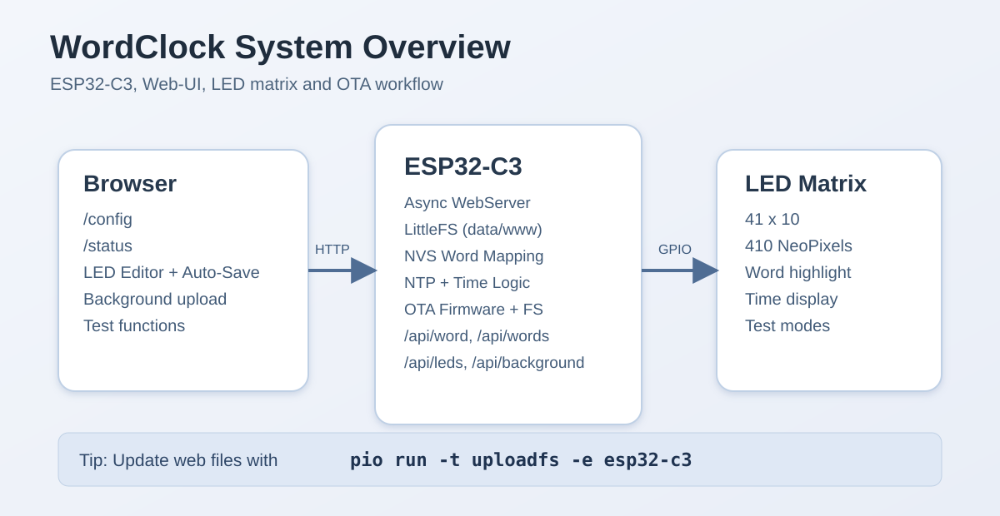
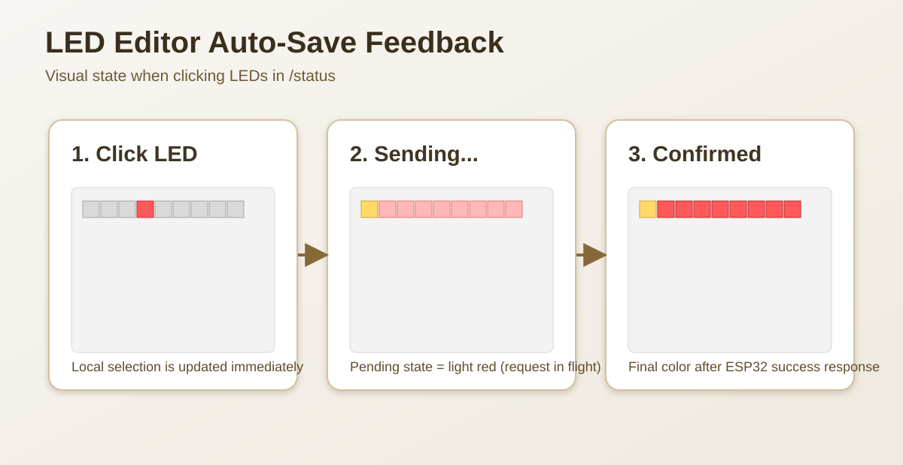
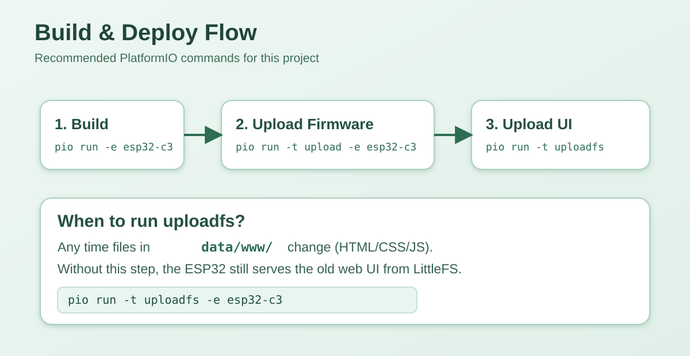

# WordClock (ESP32-C3)

Digitale WordClock mit ESP32-C3, NeoPixel-LED-Matrix, Web-UI, NTP-Zeitsynchronisation und OTA-Updates.



## Features

- Deutsche Wortuhr auf einer `41 x 10` Matrix (`410` LEDs).
- Web-UI für Konfiguration, LED-Tests und Wort-/LED-Mapping.
- Live-Editor für Wörter:
  - LED-Klick speichert sofort (Auto-Save, kein separater Speichern-Button nötig).
  - Während des Sendens: hellrotes Feedback in der Matrix.
  - Nach ESP32-Bestätigung: finale Farbe zur sichtbaren Bestätigung.
- Hintergrundbild-Upload für den LED-Editor.
- WLAN-Setup mit AP-Fallback.
- NTP-Synchronisation, Helligkeit, Testmodi.
- OTA für Firmware und LittleFS-Dateisystem.

## Hardware / Voraussetzungen

- ESP32-C3 DevKitM-1
- NeoPixel-kompatibler LED-Strip / Matrix
- PlatformIO (VS Code oder CLI)
- USB-Verbindung für Erst-Setup (optional bei vorhandenem OTA)

## Projektstruktur

- `src/` Firmware (u.a. Webserver, Zeitlogik, LED-Mapping)
- `include/` Header / Konfiguration
- `data/www/` Weboberfläche (LittleFS)
- `platformio.ini` Build- und Upload-Konfiguration

## Build & Upload

### 1. Projekt bauen

```bash
pio run -e esp32-c3
```

### 2. Firmware hochladen

Aktuell ist OTA in `platformio.ini` gesetzt (`upload_protocol = espota`):

```bash
pio run -t upload -e esp32-c3
```

Für USB-Upload temporär in `platformio.ini` umstellen:

```ini
upload_protocol = esptool
upload_port = /dev/cu.usbmodemXXXXX
monitor_port = /dev/cu.usbmodemXXXXX
```

Dann:

```bash
pio run -t upload -e esp32-c3
```

### 3. Web-Dateien (LittleFS) hochladen

Bei Änderungen in `data/www/*`:

```bash
pio run -t uploadfs -e esp32-c3
```

## Erstinbetriebnahme

1. Gerät starten.
2. Bei fehlendem WLAN startet ein AP (SSID `wordclock`).
3. Im Browser `http://192.168.4.1` öffnen und WLAN konfigurieren.
4. Danach Zugriff im Heimnetz über `http://wordclock.local` (oder IP).

## Wichtige Web-Seiten

- `/` bzw. `/config` Konfiguration
- `/status` LED-Editor / Wort-Mapping
- `/test`, `/testfirst`, `/testallatonce` Testfunktionen

## Entwicklung

Serieller Monitor:

```bash
pio device monitor -e esp32-c3
```

Hinweis: Nach UI-Änderungen immer `uploadfs` ausführen, sonst ist auf dem Gerät noch die alte Web-Version.

## Visuals

### LED Editor Auto-Save



### Build and Upload Flow



## Lizenz

Dieses Projekt steht unter der [MIT-Lizenz](LICENSE).
